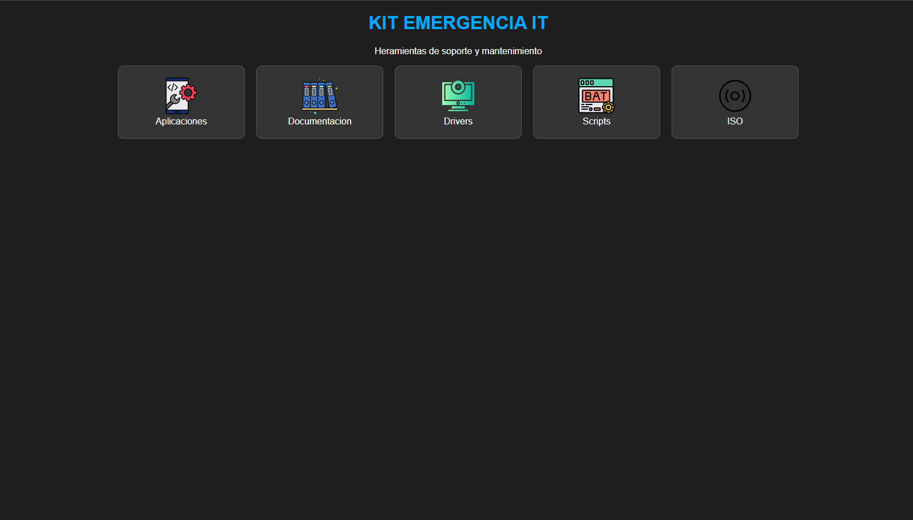

# Entornos de arranque e imágenes ISO

## Introducción

El Kit de Emergencia IT incorpora diferentes imágenes ISO arrancables que permiten realizar tareas de diagnóstico, mantenimiento y recuperación sin depender del sistema operativo instalado en el equipo.

Las imágenes se almacenan en la carpeta `ISO` del USB y se ejecutan mediante el menú de arranque de Ventoy.

---

## Entornos disponibles

| Entorno | Uso principal |
|---|---|
| Clonezilla Live | Clonado y creación o restauración de imágenes de discos |
| GParted Live | Creación, modificación y gestión de particiones |
| Hiren's BootCD PE | Diagnóstico, mantenimiento y recuperación en entorno Windows PE |
| Rescuezilla | Copias de seguridad, clonación y restauración mediante interfaz gráfica |
| Ubuntu Live | Diagnóstico, acceso a archivos y recuperación mediante un entorno Linux |
| WinPE11 | Entorno Windows PE para tareas de mantenimiento y recuperación |

---

## Clonezilla Live

**Clonezilla Live** se incorporó al kit para realizar operaciones de clonación y creación de imágenes de discos.

Puede utilizarse, por ejemplo, antes de realizar una intervención importante sobre un equipo para disponer de una copia del disco que permita su posterior restauración.

---

## GParted Live

**GParted Live** permite administrar las particiones de los dispositivos de almacenamiento desde un entorno independiente.

Puede utilizarse para crear, eliminar, redimensionar o comprobar particiones cuando sea necesario realizar tareas de mantenimiento sobre un disco.

---

## Hiren's BootCD PE

**Hiren's BootCD PE** proporciona un entorno basado en Windows PE que incorpora diferentes herramientas de diagnóstico, mantenimiento y recuperación.

Permite disponer de un entorno Windows independiente cuando el sistema operativo instalado presenta problemas de arranque o requiere tareas de diagnóstico.

---

## Rescuezilla

**Rescuezilla** proporciona una interfaz gráfica para realizar copias de seguridad, clonación y restauración de discos.

Se incorporó como alternativa gráfica para determinadas operaciones de copia y recuperación.

---

## Ubuntu Live

**Ubuntu Live** permite iniciar un entorno Linux directamente desde el USB sin necesidad de instalarlo en el equipo.

Puede utilizarse para realizar diagnósticos, comprobar el funcionamiento del hardware o acceder a archivos cuando el sistema operativo instalado presenta problemas.

---

## WinPE11

**WinPE11** proporciona un entorno Windows PE arrancable destinado a tareas de diagnóstico, mantenimiento y recuperación.

Resulta útil cuando es necesario trabajar sobre un equipo Windows desde un entorno independiente del sistema instalado.

---

## Selección mediante Ventoy

Al arrancar el equipo desde el USB, Ventoy detecta las imágenes disponibles y presenta un menú desde el que puede seleccionarse el entorno necesario para cada intervención.

Esto permite mantener diferentes herramientas de arranque en un único dispositivo sin tener que preparar una memoria USB independiente para cada ISO.

  

  <em>Figura 1. Menú de arranque de Ventoy con los diferentes entornos ISO del Kit de Emergencia IT.</em>

---

## Resultado

La incorporación de diferentes entornos arrancables convierte el USB en una herramienta flexible para afrontar distintos escenarios de soporte técnico.

La selección del entorno depende del tipo de incidencia: gestión de particiones, clonación, recuperación de información, diagnóstico o mantenimiento del sistema.
